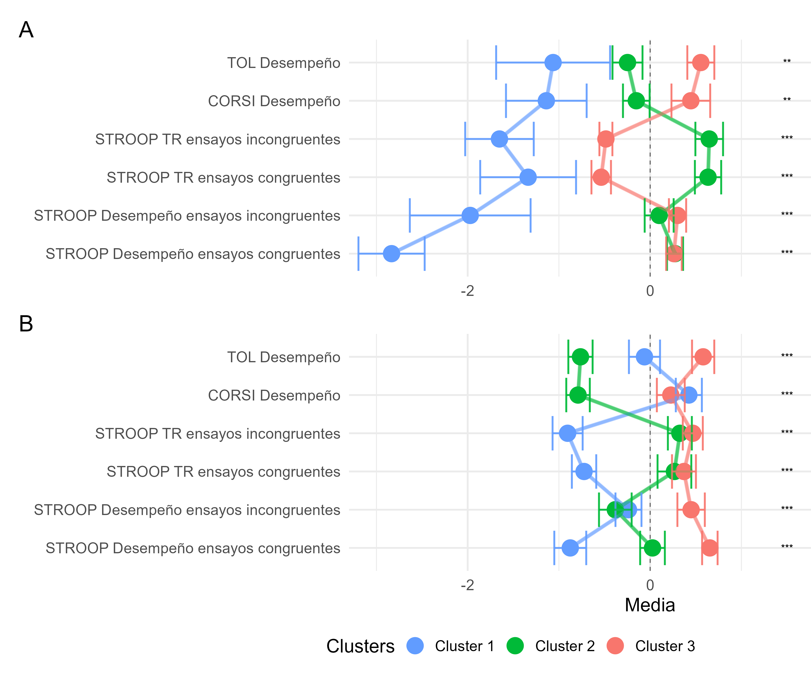

<style>
#main-img-left {
  position: absolute;
  top: 50%;
  left: 23%;
  transform: translate(-50%, -50%);
  width: 40%;   /* ajustá el tamaño del logo */
  object-fit: contain;
  overflow: hidden;   /* que no se salga */
  max-height: 50%;   /* asegurás que no “empuje” */
}

#main-img-right {
  position: absolute;
  right: 3%;
  top: 20%;
  width: 220px;
  height: 220px;
  object-fit: contain;
  overflow: hidden;   /* que no se salga */
  max-height: 90%;   /* asegurás que no “empuje” */
}
</style>


```{r, include=FALSE}

## Paquetes

library(qrcode)
library(dplyr)
library(rsvg)

## Opciones

knitr::opts_chunk$set(echo = FALSE,
                      warning = FALSE,
                      tidy = FALSE,
                      message = FALSE,
                      fig.align = 'center',
                      out.width = "100%")

options(knitr.table.format = "html") 

## Código QR

# qr_code("https://github.com/FedeGiovannetti/Poster_AACC_2025", ecl = "H") %>%
#   generate_svg("QR_Poster_AACC_2025.svg", foreground = "white", background = "transparent")
# 
# rsvg_png("QR_Poster_AACC_2025.svg", "QR_Poster_AACC_2025.png", width = 1000, height = 1000)

```

<span style="display: block; margin-top: -5px;">

## Antecedentes

<span style="font-size:30px; font-weight:normal;">
Las ciencias del desarrollo reconocen que las diferencias individuales en el desarrollo cognitivo pueden ser adaptaciones al contexto y no necesariamente desempeños atípicos. Los análisis de clústeres ayudan a identificar perfiles diversos, pero faltan estudios que integren datos de distintas evaluaciones y poblaciones, lo que limita su uso en el diseño de intervenciones.
</span>

```{r, include=FALSE}
knitr::write_bib(c('posterdown', 'rmarkdown','pagedown','dplyr','ggplot2','base','diceR'), 'packages.bib')

cat(
"
@Manual{RStudio,
  title = {RStudio: Integrated Development Environment for R},
  author = {{RStudio Team}},
  organization = {RStudio, PBC},
  address = {Boston, MA},
  year = {2024},
  url = {http://www.rstudio.com/},
}",
file = "packages.bib",
append = TRUE
)
```

## Objetivos

<span style="font-size:35px; font-weight:bold;">
A. Analizar la diversidad de perfiles de desempeño en tareas con demandas ejecutivas en niños y niñas de edad preescolar y de bajo nivel socioeconómico del Área Metropolitana de Buenos Aires.

<span style="font-size:35px; font-weight:bold;">
B. Comparar la implementación de técnicas de clusterización en dos muestras con diferente composición demográfica.
</span>

## Métodos

<span style="font-size:30px; font-weight:normal;">
Se analizaron dos muestras de proyectos desarrollados en la UNA: la muestra A estuvo compuesta por 58 participantes (Medad=5.82; DS=0.28), y la muestra B por 106 participantes (Medad=5.34; DS=0.33). Para ambas muestras, se evaluaron procesos de control inhibitorio (CI), memoria de trabajo (MT) y planificación (PL). 
</span>

<span style="font-size:30px; font-weight:normal;">
Los datos del desempeño fueron analizados mediante distitnos métodos de clusterización (k-means, PAM, Diana y jerárquicos) y distancias (euclideana y manhattan), iterando en distinta cantidad de clústeres (k) para cada muestra. Posteriormente se analizaron y compararon las soluciones obtenidas para cada muestra.
</span>

<span style="font-size:30px; font-weight:normal;">
Todos los análisis se realizaron mediante el lenguaje R versión 4.4.2 [@R-base], en Rstudio [@RStudio]. Los principales paquetes utilizados fueron dplyr [@R-dplyr], ggplot2 [@R-ggplot2] y diceR [@R-diceR] .
</span>


## Resultados

Se seleccionó un número final de k=3 mediante K-medias y PAM. Los grupos difirieron significativamente entre sí en todas las tareas (p <.05), mostrando similitudes y diferencias para cada muestra. 

- <span style="color:#619CFF; font-weight:bold;">Clúster 1</span> presentó desempeños y tiempos de reacción (TR) bajos en CI en ambas muestras. Para MT, mostró desempeños bajos en la muestra A y altos en la muestra B.<br>
- <span style="color:#00BA38; font-weight:bold;">Clúster 2</span> presentó desempeños medios en CI en ambas muestras, con RT altos en la muestra A, acompañados de desempeños bajos en PL.<br>
- <span style="color:#F8766D; font-weight:bold;">Clúster 3</span> tuvo desempeños medios-altos en CI y PL en ambas muestras. En los TR de CI, presentó TR bajos en la muestra A, y altos en la muestra B. <br>


```{r figura_2_guardar, include=FALSE,  fig.width = 12, fig.height = 10}
library(patchwork)
library(ggplot2)


Plot_A <- readRDS("Figuras/FiguraMuestraA.Rds")  +
  geom_point(size = 8) +
  geom_line(linewidth = 2, alpha = 0.4)+
  geom_errorbar(aes(ymin = Mean - SE,
                    ymax = Mean + SE), 
                    alpha = 0.8, size = 1)

Plot_B <- readRDS("Figuras/FiguraMuestraB.Rds")+
    geom_point(size = 8) +
  geom_line(linewidth = 2, alpha = 0.4)      +
  geom_errorbar(aes(ymin = Mean - SE,
                    ymax = Mean + SE), 
                    alpha = 0.8, size = 1)


p <-   (Plot_A / Plot_B) +

  patchwork::plot_layout(
    guides = 'collect',
    axis_title="collect"
    ) +
  plot_annotation(tag_levels = 'A')&
    # theme(legend.position = "bottom")
  
      # theme_minimal(base_size = 20) &
  theme(
    legend.position = "bottom",
    legend.justification = -0.15,
    
    plot.margin = margin(
      t = 10,  # Top margin
      r = -150,  # Right margin
      b = 5,  # Bottom margin
      l = 10 # Left margin
      )
    
    )


ggsave("Figuras/Figura_1_poster.png", p, width = 12, height = 10, units = "in")


p


```

<figure style="width:200%; margin:0 auto; text-align:center;">
  
  <figcaption>
  <span style="font-weight:bold;">Figura 1.</span> 
  Comparación los desempeños y tiempos de reacción de los clústeres<br>generados para cada muestra (valores z).* p<0.05; ** p<0.01; *** p<0.001.
  </figcaption>
</figure>

<span style="display: block; margin-top: -5px;">

```{r, fig.height= 6, fig.width=12, echo=FALSE}

library(knitr)
library(gridExtra)
library(grid)
library(magick)


vp_A <- viewport(
  x = 0.5, y = 0.5, width = 1, height = 0.95,
  just = c("center", "center")
)
# 'vp_B' will take up the bottom half with some top margin
vp_B <- viewport(
  x = 0.5, y = 0.5, width = 1, height = 0.95,
  just = c("center", "center")
)


recorte_imagen <- function(imagen){
  img <- image_read(imagen)
  info <- image_info(img)
  
  # Tomamos el lado más corto como referencia
  lado <- min(info$width, info$height)
  
  img_scaled <- image_scale(img, paste0("x", lado))
  
  # img_cropped <- image_crop(img_scaled, paste0(lado,"x",lado), gravity = "Center")
  return(img_scaled)
  
}


grob_con_texto_A <- grobTree(
  rasterGrob(recorte_imagen("img/Imagen_Muestra_A_cuadrada.jpg"), vp = vp_A),
  textGrob("A", x = 0.05, y = 0.95, just = c("left", "top"),
           gp = gpar(col = "black", fontsize = 30, fontface = "bold"))
)


grob_con_texto_B <- grobTree(
  rasterGrob(recorte_imagen("img/Imagen_Muestra_B_cuadrada.jpg"), vp = vp_B),
  textGrob("B", x = 0.05, y = 0.95, just = c("left", "top"),
           gp = gpar(col = "black", fontsize = 30, fontface = "bold"))
)


figura_2 <- arrangeGrob(
  grob_con_texto_A,
  grob_con_texto_B,
  # grob_B,
  ncol = 2
)


ggsave("Figuras/Figura_2_poster.png", figura_2, width = 12, height = 6, units = "in")

```

<figure style="width:200%; margin:0 auto; text-align:center;">
  
  <figcaption>
  <span style="font-weight:bold;">Figura 2.</span> 
  Imágenes de las inmediaciones del barrio donde habitaban    <br>
  los/as participantes de las muestras A y B respectivamente.    
  </figcaption>
</figure>

<div style="height:50px;"></div>

## Conclusiones

- Los métodos de agrupamiento permitieron identificar perfiles heterogéneos entre y dentro de las muestras. 
- Estos resultados contribuyen al desarrollo de un enfoque metodológico relevante en el contexto de intervenciones que contemplen la diversidad cognitiva infantil.


<div style="height:3150px;"></div>

### Referencias
<span style="display: block; margin-top: -3px;">

::: {#refs}
:::


  
  
