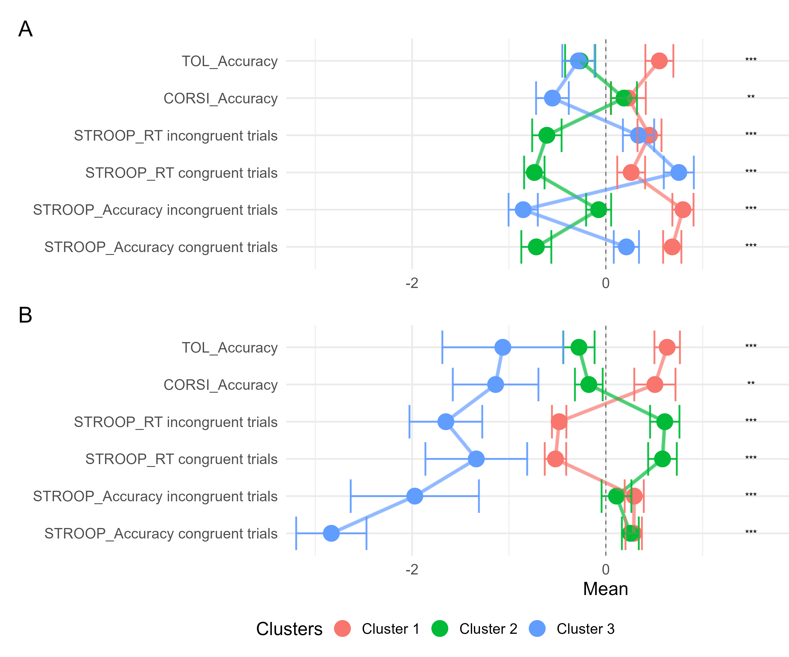
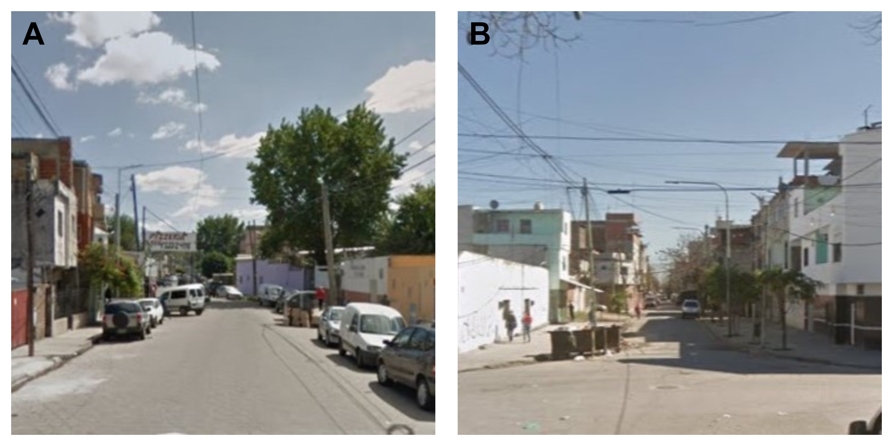

<style>
#main-img-left {
  position: absolute;
  top: 50%;
  left: 25%;
  transform: translate(-50%, -50%);
  width: 40%;   /* ajustá el tamaño del logo */
}
</style>

```{r, include=FALSE}
knitr::opts_chunk$set(echo = FALSE,
                      warning = FALSE,
                      tidy = FALSE,
                      message = FALSE,
                      fig.align = 'center',
                      out.width = "100%")
options(knitr.table.format = "html") 
```

<span style="display: block; margin-top: -5px;">

## Antecedentes

Las ciencias del desarrollo muestran una creciente comprensión de que las diferencias individuales en el desarrollo cognitivo no necesariamente deberían verse como desempeños atípicos, sino como posibles adaptaciones al contexto. En este marco, los análisis de clústeres resultan herramientas valiosas para identificar estructuras latentes y perfiles de desempeño diversos. Sin embargo, no existen estudios que integren resultados de muestras con distintos protocolos de evaluación y composición demográfica, limitando el aporte de estas metodologías al diseño de intervenciones.

```{r, include=FALSE}
knitr::write_bib(c('posterdown', 'rmarkdown','pagedown'), 'packages.bib')
```

## Objetivos

A. Analizar la diversidad de perfiles de desempeño en tareas con demandas ejecutivas en niños y niñas de edad preescolar y de bajo nivel socioeconómico del Área Metropolitana de Buenos Aires

B. Comparar la implementación de técnicas de clusterización en dos muestras con diferente composición demográfica

## Métodos

Se analizaron dos muestras de proyectos desarrollados en la UNA: la muestra A estuvo compuesta por 58 participantes (Medad=5.82; DS=0.28), y la muestra B por 106 participantes (Medad=5.34; DS=0.33). Para ambas muestras, se evaluaron procesos de control inhibitorio (CI), memoria de trabajo (MT) y planificación (PL). 

Los datos del desempeño fueron analizados mediante diversas técnicas de clusterización, iterando en distinta cantidad de clústeres (k) para cada muestra. Posteriormente se analizaron y compararon las soluciones obtenidas para cada muestra.


## Resultados

Se seleccionó un número final de k=3 mediante K-medias y PAM. Los grupos difirieron significativamente entre sí en todas las tareas (p <.05), mostrando similitudes y diferencias para cada muestra. 

- <span style="color:#F8766D; font-weight:bold;">Clúster 1</span> presentó desempeños y tiempos de reacción (TR) bajos en CI En ambas muestras. Para MT, mostró desempeños bajos en la muestra A y altos en la muestra B.<br>
- <span style="color:#00BA38; font-weight:bold;">Clúster 2</span> presentó desempeños medios en CI y bajos en PL.<br>
- <span style="color:#619CFF; font-weight:bold;">Clúster 3</span> tuvo desempeños medios-altos en CI y PL. En los TR de CI, presentó TR medios en la muestra A, y altos en la muestra B. <br>

## References


```{r figura_2_guardar, include=FALSE,  fig.width = 12, fig.height = 10}
library(patchwork)
library(ggplot2)

Plot_soldati <- readRDS("FiguraSoldati.Rds")+
    geom_point(size = 8) +
  geom_line(linewidth = 2, alpha = 0.4)      +
  geom_errorbar(aes(ymin = Mean - SE,
                    ymax = Mean + SE), 
                    alpha = 0.8, size = 1)

Plot_dominico <- readRDS("FiguraDominico.Rds")  +
  geom_point(size = 8) +
  geom_line(linewidth = 2, alpha = 0.4)+
  geom_errorbar(aes(ymin = Mean - SE,
                    ymax = Mean + SE), 
                    alpha = 0.8, size = 1)

p <-   (Plot_soldati / Plot_dominico) +

  patchwork::plot_layout(
    guides = 'collect',
    axis_title="collect"
    ) +
  plot_annotation(tag_levels = 'A')&
    # theme(legend.position = "bottom")
  
      # theme_minimal(base_size = 20) &
  theme(
    legend.position = "bottom",
    legend.justification = -0.15,
    
    plot.margin = margin(
      t = 10,  # Top margin
      r = -150,  # Right margin
      b = 5,  # Bottom margin
      l = 10 # Left margin
      )
    
    )


ggsave("Figura_1_poster.png", p, width = 12, height = 10, units = "in")

p


```


<figure style="width:200%; margin:0 auto; text-align:center;">
  
  <figcaption>
  <span style="font-weight:bold;">Figura 1.</span> 
  Comparación los desempeños y tiempos de reacción<br>
  de los clústeres generados para cada muestra (valores z)
  </figcaption>
</figure>

<span style="display: block; margin-top: -5px;">

```{r, fig.height= 6, fig.width=12, echo=FALSE}

library(knitr)
library(gridExtra)
library(grid)
library(magick)


vp_A <- viewport(
  x = 0.5, y = 0.5, width = 1, height = 0.95,
  just = c("center", "center")
)
# 'vp_B' will take up the bottom half with some top margin
vp_B <- viewport(
  x = 0.5, y = 0.5, width = 1, height = 0.95,
  just = c("center", "center")
)


recorte_imagen <- function(imagen){
  img <- image_read(imagen)
  info <- image_info(img)
  
  # Tomamos el lado más corto como referencia
  lado <- min(info$width, info$height)
  
  img_scaled <- image_scale(img, paste0("x", lado))
  
  # img_cropped <- image_crop(img_scaled, paste0(lado,"x",lado), gravity = "Center")
  return(img_scaled)
  
}


grob_con_texto_A <- grobTree(
  rasterGrob(recorte_imagen("Imagen_Muestra_A_cuadrada.jpg"), vp = vp_A),
  textGrob("A", x = 0.05, y = 0.95, just = c("left", "top"),
           gp = gpar(col = "black", fontsize = 30, fontface = "bold"))
)


grob_con_texto_B <- grobTree(
  rasterGrob(recorte_imagen("Imagen_Muestra_B_cuadrada.jpg"), vp = vp_B),
  textGrob("B", x = 0.05, y = 0.95, just = c("left", "top"),
           gp = gpar(col = "black", fontsize = 30, fontface = "bold"))
)


figura_2 <- arrangeGrob(
  grob_con_texto_A,
  grob_con_texto_B,
  # grob_B,
  ncol = 2
)


ggsave("Figura_2_poster.png", figura_2, width = 12, height = 6, units = "in")

```

<figure style="width:200%; margin:0 auto; text-align:center;">
  
  <figcaption>
  <span style="font-weight:bold;">Figura 2.</span> 
  Imágenes de las inmediaciones del barrio donde habitaban    <br>
  los/as participantes de las muestras A y B respectivamente.    
  </figcaption>
</figure>


  
  
